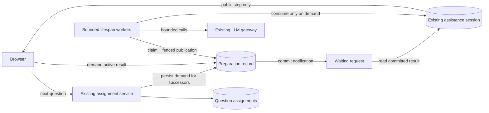

# Assistance preparation

This stack adds preparation in five reviewable stages:

1. Optional method contract and first-step adapter.
2. Durable, fenced execution with bounded in-process workers.
3. Server-owned active question and configurable lookahead.
4. A frontend assistance owner using server-selected questions.
5. Measurement, disabled-by-default rollout, and operating guidance.

## Extending a method

`AssistanceMethod` defaults to no preparation. Opt in by implementing:

- `plan_preparation(context)`: pure, deterministic, inexpensive; return a
  `PreparationSpec` with a stable name, version, and JSON input snapshot.
- `prepare(spec)`: compute one private JSON artifact. Work must be bounded,
  safe to abandon, and require no future human answer.
- `consume_preparation(spec, artifact)`: validate the artifact and return an
  interaction step. Partial artifacts may require foreground composition.
  Never silently regenerate a prepared artifact.

Use `InitialStepPreparation` when the entire first step can run early. It
calls the existing `start` implementation, preserving prompts, models,
randomization, scoring, and private interaction state. Top-N and Human-as-a-Tool
use this adapter. Human-as-a-Tool prepares only its initial decomposition and
confidence scoring; `advance` still requires actual human input.

Bump the preparation version whenever artifact or input interpretation changes.
The runtime owns identity, participant isolation, persistence, deadlines, and
concurrency. Methods do not choose shared cache keys. Snapshots deliberately
exclude ground truth and upload metadata. Private artifacts and method state
must never be returned as queue metadata.

The adapter preserves method logic. This runtime changes foreground execution:
eligible initial assistance uses the worker pool even before speculative prefetch
is enabled, and retries reuse durable results, including terminal NONE steps.

## Durable execution

The API lifespan owns eight workers by default, configurable from 2 to 64 with
`prefetch.worker_count` / `PREFETCH__WORKER_COUNT`. One takes only foreground demand;
others prefer foreground demand before speculative work. PostgreSQL owns claims
across processes. A claim lasts 195 seconds; computation has a 180-second budget.
A crashed claim can be recovered after expiry, at most twice per stage. A fresh
owner token fences every publication. This is not exactly-once provider billing:
a provider may finish work after its caller times out.

Preparation produces a private artifact. Consumption runs only after foreground
demand and has its own claim, so a partial-artifact method can do foreground
composition without racing duplicate starts. The existing assistance-session
uniqueness constraint remains the final publication guard. Terminal NONE results
are reused. Method defaults are resolved before taking the input snapshot.

All workers use independent, short-lived database sessions. Waiting HTTP requests
release their transaction and await a completion event, with no per-request polling.
One dedicated PostgreSQL LISTEN connection per API process receives notifications
from a trigger on preparation inserts, status/demand changes, and deletes. This
also covers cancellation/reset cascades and completion in another API process.
A notification contains only a preparation ID and status, never content. Each
request registers locally before reading durable state; LISTEN is established
before that read. Reconnect wakes existing requests to recheck missed completions.
Notifications are hints, not stored work or permission to publish.

Workers wake on work notifications. A 30-second worker recovery sweep discovers
expired claims after process loss; it does not poll on behalf of waiting requests.
Recovery can therefore start up to 30 seconds after claim expiry. Waiting requires
neither an open transaction nor a separate listener connection per request.
Arriving before preparation finishes only waits for the same job; it never starts
a second provider call or selects a no-assistance fallback. Transport retries
reattach to the same durable result. The bounded HTTP wait may return 503 so the
browser can retry if infrastructure recovery exceeds its request lifetime.

The listener requires a direct PostgreSQL connection (or session-mode pooling),
not a transaction-mode pool. The application already connects directly to PostgreSQL
and already depends on asyncpg; no broker or new package is introduced. Follow
[PostgreSQL's LISTEN-before-read ordering](https://www.postgresql.org/docs/current/sql-listen.html)
when changing this logic. Shutdown cancels local tasks; durable claims recover
after expiry. Provider calls share an eight-slot per-process limit; speculation
uses at most four. Limits multiply with the number of API processes.

Input identity includes rater, question, session start, method name, preparation
version and serialized inputs. A method cannot accidentally share work between
questions by omitting a question identifier from its own inputs. Session reset
and end are checked again under a rater-row lock before publication.

Startup requires LISTEN to subscribe within 10 seconds. `/api/health` returns 503
while the listener is disconnected or a runner task has stopped. Waiting requests
fail with a retryable 503 when their listener disconnects; reconnect reestablishes
LISTEN before new waits read durable state. No database polling fallback is added.

Graceful shutdown cancels and awaits local workers, then spends at most five seconds
releasing only their still-owned claims. Prepared artifacts and attempt counts are
retained. Another process can resume immediately; hard crashes or failed cleanup
still use lease expiry. Cancellation does not guarantee that a provider avoided billing.

Provider-slot waits count against the 180-second execution budget; time waiting
unclaimed in the durable queue does not. Raising workers does not raise the shared
eight-provider-call limit (four speculative). Validate expected arrival bursts
before deployment, and inspect assistance waits and timeouts during the first study.
The default is a starting limit, not a measured production capacity guarantee.

## Authoritative queue

`GET /raters/next-question` serves one current question and reserves up to `k` successors.
Set `prefetch.lookahead_questions` (or `PREFETCH__LOOKAHEAD_QUESTIONS`) to `k`,
from 0 to 5, default 1. The bound limits assignment hoarding and speculative cost;
raise it only with measurements. Zero gives a queue-only baseline. Shrinking `k`
stops refills beyond the new bound; already reserved work drains without discarding
paid results. Speculation stops immediately at zero, subject to in-flight calls. Serving activates the selected head in the same transaction as selection. The existing
experiment assignment lock serializes selection; a rater-row lock serializes
queue mutation, submission, reset, and end. Selection retains the existing
coverage tiers and includes the active question's parent when choosing a sibling.
Preview reservations do not count toward real participant coverage.

Before first activation, a non-preview question is replaced only if its submitted,
non-preview ratings have reached the target and another eligible question remains
underfilled. The existing reservation-aware selector chooses among unfinished
questions, preserving parent continuity within those candidates. A queued
replacement retains its reservation and prepared work; otherwise the queue reserves
it normally. Releasing the old head cancels its preparation and fences late results.
The next-question response is authoritative: the browser displays and demands
only the returned question.

Smaller coverage differences, preview navigation, and already activated questions
do not trigger replacement. If no eligible unfinished work remains, the existing
completed-question policy stays in effect. This is a serving-time snapshot, not a
guarantee against another participant submitting immediately afterward. It trades
occasional unused preparation for better completion coverage without a new queue,
selection algorithm, or schema change.

New queue submissions carry assignment ID and generation. An exact retry returns
the existing rating; a conflicting answer returns 409. The old submission
contract remains unchanged for sessions that have not entered the queue protocol.
Legacy `/next-question` remains an object or null, including during queue rollout.

Only an activated question can start assistance or be submitted. Grace preserves
the active question and releases unactivated reservations. Ending releases all
reservations. Preview reset deletes assignments and invalidates older signed
session generations. Failed multi-turn SKIP results require an explicit skip
mutation and cannot reselect the same question in that session.

Set `prefetch.experiment_ids` (or `PREFETCH__EXPERIMENT_IDS` as a JSON array) to opt
experiments in. The default is empty. Removing an experiment stops new speculative
requests and limits further refills to one; existing active work and already
reserved work can drain through the same protocol.

### Server-owned scheduling

`/next-question` reserves, rechecks coverage, and activates the current question
under the existing assignment lock. It then persists preparation demand for
successors before returning, without waiting for provider computation. Preview
pins use the same serving path. A second fill after activation replenishes any
successor promoted by the coverage check.

Question responses carry assignment ID and generation for exact submission
retries. The browser does not reserve, activate, or prepare successors. Explicit
skip and client-visible wait telemetry remain separate actions. Legacy clients
may omit assignment identity; the server still requires their question to match
an active assignment once the session enters queue mode.

Legacy reservations inserted after the migration backfill are valid before
queue enrollment. Enrollment marks those already-served reservations active,
preventing assistance from getting stuck after a rolling deployment.
## Browser ownership

`useRaterQueue` owns the displayed question, assistance responses, and frozen
retry inputs. It calls `/next-question` (or the preview question endpoint), then
`/assistance/start`. Selection, activation, refill, and speculative demand belong
to the server. No browser queue revision, refill promise, or prepared-ID cache is
needed. `AssistancePanel` renders the supplied resource and submits human input.

Fresh and restored sessions wait for intro acknowledgment before requesting a
question. Submission transport failures freeze the exact request, including the
assignment ID and generation returned with the question. Assistance advances
retry the frozen input and turn counter. Submission conflicts offer an explicit
refresh from saved progress. Explicit failed-step skipping remains a mutation;
client-visible wait telemetry remains a separate best-effort observation.

The server enrolls allowlisted experiments when serving questions. Removing an
experiment stops new enrollment and speculative work; existing queue sessions
drain at depth one. Old tabs can still submit their active question without the
new identity fields. A supplied identity is always checked.

## Data flow

## Measurements

All events use the existing structured JSON logger, under `attributes.prefetch.event`.
No prompts, human answers, artifacts, or credentials are included in these events.

| Event | Meaning | Use |
| --- | --- | --- |
| `scheduled` | First speculative preparation record | Work offered for preparation |
| `demand` | First foreground demand, with `ready` | Prepared-artifact hit rate; a hit can still need foreground composition |
| `execution` | Preparation/consumption duration, outcome, claim attempt | Failure rate and execution time by method |
| `server_wait` | One HTTP request's wait for a durable result | Server-side latency; retries produce additional observations |
| `visible_wait` | Browser assistance request initiation to accepted step | Participant-facing wait proxy, excluding the final browser paint |
| `released` | Reservation released, with `unused` and prior status | Abandoned work; includes in-flight work whose provider cost is uncertain |
| `retired` | Expired record deleted, with `unused` | Final unused-work count, including sessions that never returned; delayed by retention |
| `fenced` | An old owner attempted publication | Recovery and stale-result diagnosis |
| `provider_call` | One gateway invocation, model, duration, speculation flag, reported tokens | Work/spend proxy; SDK-internal retries are not separate gateway invocations |

Browser observations are authenticated, ownership-checked, bounded, best effort,
and client-reported. Use them for rollout evaluation, never billing or research
outcome scoring. Provider token counts can be unavailable on errors/cancellation.
Neither a cancelled task nor a fenced result proves that a provider did not bill.

After consumption, the existing assistance session owns payload/state and the
preparation record drops its duplicate artifact and input snapshots. Once a
record is more than 24 hours past its deadline, the lifespan runner deletes it in
batches of at most 500, at most once per minute per foreground worker. This is
retention cleanup, not a heartbeat. Logs follow the deployment's existing log
retention policy. Ratings and assistance sessions keep their existing retention.

## Rollout and operation

1. Merge the stack in order. Retarget each remaining PR after its base merges;
   rebase/revalidate if the repository uses squash merges. Apply migrations before
   deploying API code, then deploy the frontend. Both old and new clients use the existing
   next-question flow; the server enables scheduling for opted-in experiments.
2. Keep `prefetch.experiment_ids = []` initially. Confirm ordinary rating,
   Human-as-a-Tool advance, preview reset, and deadline/grace behavior. Establish
   browser/server wait and provider-call baselines for each method/model.
3. Enable one internal or preview experiment with
   `PREFETCH__EXPERIMENT_IDS='[123]'`. Restart API processes after changing settings.
   First use `PREFETCH__LOOKAHEAD_QUESTIONS=0` for the queue-only baseline, then 1.
   Exercise refresh, multiple tabs, delayed requests, missing provider credentials,
   expired claims, and uncertain submissions before enrolling real participants.
4. Enable a small approved experiment cohort. Compare median/p95 browser wait,
   prepared-artifact hit rate, persisted assistance outcomes, unused releases, and provider tokens
   per accepted rating with the matching baseline. Keep methods/models separate.
   Widen only after wait improves without unacceptable waste, error growth, or
   changes to assignment/answer distributions. This stack does not assert measured
   production benefits or pick a universal acceptable cost threshold.
5. To disable speculation while keeping new queue offers, set lookahead to zero.
   To stop both new offers and speculation, empty the allowlist and restart processes.
   Do not roll the database backward or remove the queue endpoints while sessions remain live.
   Active assignments can finish, existing reserved work can drain, and subsequent
   refills use depth one. Already-issued provider requests may still finish.

Keep old API shapes and nullable assignment references until sessions issued by
older releases have expired (maximum configured duration + grace + token margin),
then check logs before removing compatibility code in a separate PR. Roll back the
frontend before removing any endpoint it calls. Schema downgrades are development
operations; a production rollback should keep these additive columns/tables.

Limits are per API process: eight worker loops by default, one foreground-only, eight provider
slots total, four speculative slots. Scaling API replicas multiplies those limits.
Claim fencing provides cross-process correctness, not a global provider quota.
The fixed 180-second execution budget and 195-second claim lifetime trade bounded
cost/recovery for possible NONE results on unusually slow methods. Change them
together after measurement; execution must remain shorter than claim lifetime.
Methods must use the shared LLM gateway for provider calls and must not perform
irreversible actions during preparation. Human-input advance remains on demand;
turn-aware clients can retry a turn safely. Legacy clients without a turn counter
retain their response contract, but do not gain retry deduplication after commit.

Method authors can override `preparation_params` to resolve deployment defaults
before snapshotting. Runtime identity also includes those effective parameters
and the system prompt, even if a partial-artifact method omits them from its own
preparation inputs. Started interactions retain their captured system prompt for
later human-input turns, including an explicitly empty prompt. Sessions created
before this snapshot field existed retain the legacy fallback while draining.
Keep provider settings fixed during a study; changing deployment-wide timeouts,
retry limits, or output-token limits is an operational change, not an experiment
configuration edit.

Do not add `released.unused` and `retired.unused` together: the former is an early
signal and the latter is the final per-record count after retention. A ready
artifact that was never demanded counts as unused even if its browser never
returned to release the reservation.

## Review decisions and regression coverage

- Recheck the authenticated session generation after acquiring the existing rater
  lock. A request that waited through a preview reset must not mutate the new
  session. This adds no lock or session mechanism.
- Use the existing assistance-session row for the existing turn counter, owner token, and
  bounded claim expiry. Claim and publication use short transactions; provider
  work runs outside them. The existing execution/claim budgets also bound turns.
  Concurrent retries receive 409 while a turn runs. Retries matching the previous
  turn and its exact input receive the current step. Expired owners cannot publish. A process
  crash can still cause a repeated provider call after expiry, not repeated
  publication. This is a narrowly scoped turn guard, not another job queue.
- Keep uncertain human input frozen in the browser. An error must not re-enable
  submission against an old step while the original turn may still be running.
  Question submission conflicts require an explicit recovery action; the saved
  answer is never overwritten.
- Attach rater/question/method and preparation or assistance-session identifiers
  to provider events through a task-local context. Join rater IDs to experiments
  for speculative calls; foreground calls also include experiment ID. This uses
  the existing structured logger and excludes prompts and human input.

Regression tests cover delayed requests across reset, concurrent and committed
turn retries, expired-owner fencing, end during advance, failure recovery,
submission conflict navigation, and isolation of concurrent provider log context.

## Failure attribution and rollout evidence

`ratings.csv` appends `assistance_method` and `assistance_outcome`, joined to the
existing unique assistance session for that participant/question. New sessions
persist `provided`, intentional `no_assistance`, `provider_error`,
`invalid_response`, or runner/turn `execution_error`. Failure attribution stays
private; the participant's step shape and fallback behavior are unchanged. It
survives preparation cleanup. Missing sessions and historical rows export
`unknown`, not an inferred success. The export describes the last persisted
assistance step, not proof the participant viewed it. Do not silently exclude
failed-assistance ratings from research analysis.

The database-backed notification test holds one provider computation while 20
requests wait through another listener. It checks no repeated waiter reads,
shared publication, cancellation cleanup, deleted work, and reconnect after a
missed completion. Queue tests exercise k=0,1,3,5, refill, and rollout removal.
These establish concurrency correctness with a controlled provider, not production
latency, billing, or an unbounded load capacity claim.

Before real participant enrollment, run the pilot above at the expected number
of simultaneous raters and API replicas. Record per-method/model median/p95 wait,
provider tokens per accepted rating, failure outcome rate, unused preparations,
DB connection count, and fenced/expired claims. Include a worker restart and a
listener reconnect during active work. Compare k=0 and k=1 on matched workloads;
try larger k only if measured latency improves enough to justify cost and
reservation coverage changes. Roll back on duplicate visible steps, assignment
violations, or increased failure rate. Product owners must set acceptable spend
and latency thresholds before expansion; this implementation cannot supply
production evidence from mocked-provider tests.

Compatibility retirement is a separate deletion PR after the maximum configured
session duration, grace, and token margin have elapsed since the last old-client
deployment, and logs show no legacy traffic for that full window. Remove the
legacy browser path, handling of clients without turn counters, and nullable legacy assignment
references together only after that check. Do not add new behavior to those paths.

Provider billing remains at-least-once under a crash between provider completion
and durable publication. Fencing prevents multiple accepted results, and the
bounded attempts limit retries; neither can undo an external charge. Exactly-once
billing needs provider-supported idempotency, not another application lock.

Initial assistance HTTP waits end after 90 seconds with a retryable 503; the
180-second execution and 195-second claim budgets remain independent. The browser
keeps the loading UI and reattaches to the same persisted job after network errors
or HTTP 502/503/504, with up to six total requests and 1/2/4/5/5-second backoffs.
Other errors surface immediately. Exhaustion exposes the existing manual retry;
changing question/session or leaving the view cancels requests and retry timers.
Human-input advances keep their existing explicit retry behavior. Browser visible
wait measurements include automatic retries and their backoff delays.

The runtime reuses the existing `turn` counter and assistance event history.
Committed-turn retries must match the previous turn and its exact human input;
other mismatches return 409. A concurrent request also receives retryable 409
while the owner computes outside a transaction. There is no second assistance
revision counter. Accepted background starts append their history atomically with
session creation; their latency includes preparation and consumption, excluding
queue residence. Retries of durable results add no event or provider call.
